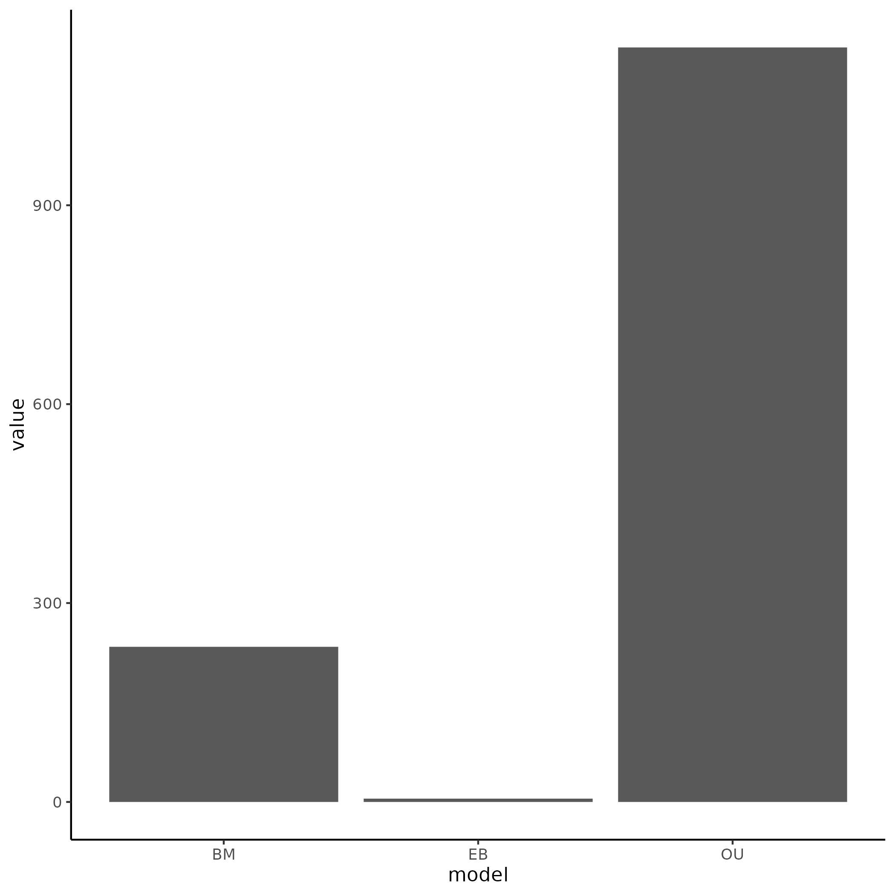
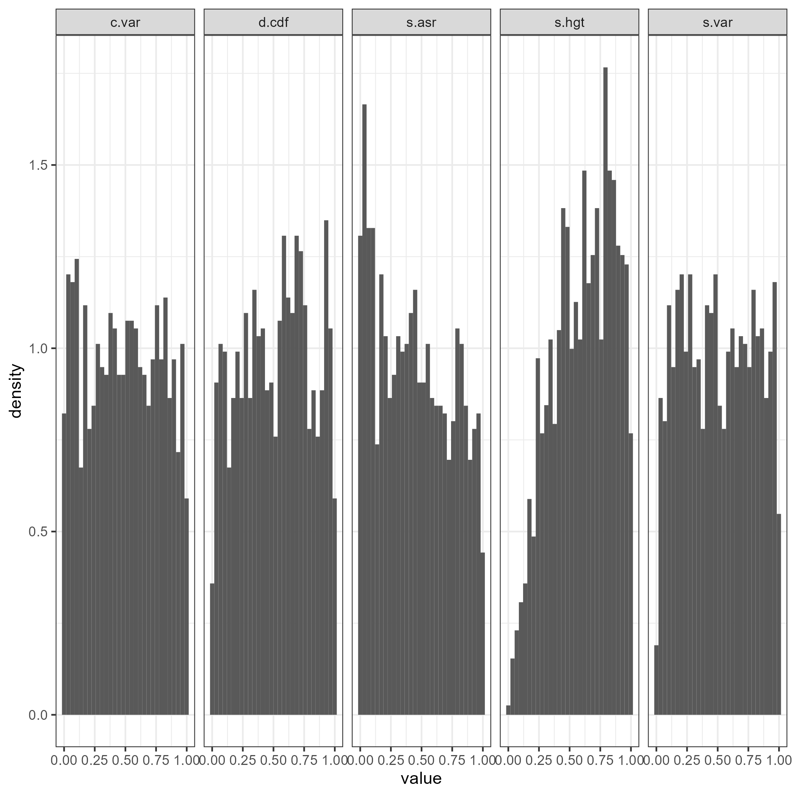

```{r setup, include=FALSE}
knitr::opts_chunk$set(echo = TRUE)
```

# Analysis of Amalgamated Species Data Adequacy

------------------------------------------------------------------------

## Introduction

The data in this analysis was taken from a [paper](https://www.nature.com/articles/s41467-020-18090-8) aiming to understand how expression evolves across multiple taxa by tracking ancestral to descendant gene expression levels. This includes data from 1903 RNA Seq datasets, with 6 organs and 21 total vertebrates total. Orthofinder was used to determine orthologs between these 21 species. Notably, the original study used expression evolution on the gene-family level and specifically used the Ornstein-Uhlenbeck model to look for shifts in expression. They noted that rate shifts increased following gene duplications. I will be analyzing the fit and adequacy of 3 models (OU, BM, and EB) to the amalgamated data.

```{r, incl}

library(tidyverse)
pval_files <- list.files("arbutus/pvals/")

readfile <- function(filename){
  res <- readRDS(paste0("arbutus/pvals/", filename))
  res
}

pvals_total <- map_df(pval_files, readfile)

p_df <- pvals_total %>% select(!m.sig) %>% transmute(c.less = c.var <= 0.05, sv.less = s.var <= 0.05, sa.less = s.asr <= 0.05, sh.less = s.hgt <= 0.05 & !is.na(s.hgt), d.less = d.cdf <= 0.05) %>% transmute(inade = c.less + sv.less + sa.less + sh.less + d.less) %>% count(inade) %>% mutate(prop = n/sum(n)) %>% mutate(inade = as.character(inade))

figure1 <- p_df %>% ggplot(aes(x = inade, y = n, fill = inade)) + geom_bar(stat = "identity") + geom_text(aes(label = round(prop, digits = 2))) +
  xlab("Number of inadequacies") + ylab("Number of genes") + labs(tag = "A") + ggtitle("Amount of genes by number of inadequacies") + theme_bw() 

```

```{r}
figure1
```

**Figure 1: Overall adequacy of data by number of inadequate test statistics per gene.** The vast majority of the data is adequate for the best-fit model.





**Figure 2: Relative (left) and absolute (right) fit of the amalgamated data for the best-fit model.** The best fit model was most commonly OU, and it was shown to have high adequacy across test statistics, as shown by the relatively uniform distributions of all statistics. Only s.asr seems to show any deviation from uniformity.

The amalgamated data overwhelmingly shows support for the Ornstein-Uhlenbeck model, and is only inadequate in s.asr; which often shows inadequacies when rate variation is not accounted for in a chosen model. The researchers detected evolution rate shifts by looking for differences in optimal trait value in OU models, suggesting that an analysis of the adequacy of muli-optima or multi-rate models may be needed to fully evaluate how well the data supports their conclusions.
