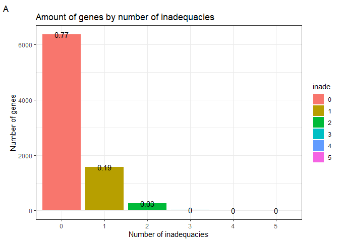

# Analysis of Amalgamated Species Data Adequacy

------------------------------------------------------------------------

## Introduction

The data in this analysis was taken from a
[paper](https://www.nature.com/articles/s41467-020-18090-8) aiming to
understand how expression evolves across multiple taxa by tracking
ancestral to descendant gene expression levels. This includes data from
1903 RNA Seq datasets, with 6 organs and 21 total vertebrates total.
Orthofinder was used to determine orthologs between these 21 species.
Notably, the original study used expression evolution on the gene-family
level and specifically used the Ornstein-Uhlenbeck model to look for
shifts in expression. They noted that rate shifts increased following
gene duplications. I will be analyzing the fit and adequacy of 3 models
(OU, BM, and EB) to the amalgamated data.

``` r
library(tidyverse)
```

    ## -- Attaching packages --------------------------------------- tidyverse 1.3.1 --

    ## v ggplot2 3.3.5     v purrr   0.3.4
    ## v tibble  3.1.6     v dplyr   1.0.8
    ## v tidyr   1.2.0     v stringr 1.4.0
    ## v readr   2.1.2     v forcats 0.5.1

    ## -- Conflicts ------------------------------------------ tidyverse_conflicts() --
    ## x dplyr::filter() masks stats::filter()
    ## x dplyr::lag()    masks stats::lag()

``` r
pval_files <- list.files("arbutus/pvals/")

readfile <- function(filename){
  res <- readRDS(paste0("arbutus/pvals/", filename))
  res
}

pvals_total <- map_df(pval_files, readfile)

p_df <- pvals_total %>% select(!m.sig) %>% transmute(c.less = c.var <= 0.05, sv.less = s.var <= 0.05, sa.less = s.asr <= 0.05, sh.less = s.hgt <= 0.05 & !is.na(s.hgt), d.less = d.cdf <= 0.05) %>% transmute(inade = c.less + sv.less + sa.less + sh.less + d.less) %>% count(inade) %>% mutate(prop = n/sum(n)) %>% mutate(inade = as.character(inade))

figure1 <- p_df %>% ggplot(aes(x = inade, y = n, fill = inade)) + geom_bar(stat = "identity") + geom_text(aes(label = round(prop, digits = 2))) +
  xlab("Number of inadequacies") + ylab("Number of genes") + labs(tag = "A") + ggtitle("Amount of genes by number of inadequacies") + theme_bw() 
```

``` r
figure1
```

<!-- -->

**Figure 1: Overall adequacy of data by number of inadequate test
statistics per gene.** The vast majority of the data is adequate for the
best-fit model.


**Figure 2: Relative (left) and absolute (right) fit of the amalgamated
data for the best-fit model.** The best fit model was most commonly OU,
and it was shown to have high adequacy across test statistics, as shown
by the relatively uniform distributions of all statistics. Only s.asr
seems to show any deviation from uniformity.

The amalgamated data overwhelmingly shows support for the
Ornstein-Uhlenbeck model, and is only inadequate in s.asr; which often
shows inadequacies when rate variation is not accounted for in a chosen
model. The researchers detected evolution rate shifts by looking for
differences in optimal trait value in OU models, suggesting that an
analysis of the adequacy of muli-optima or multi-rate models may be
needed to fully evaluate how well the data supports their conclusions.
